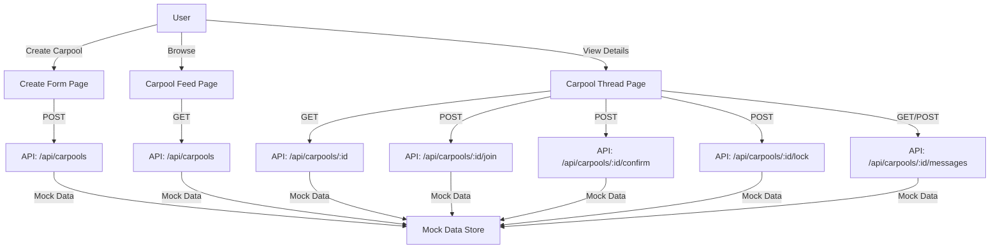

# Carpo

ol Coordination MVP Implementation Plan

## Overview

Implement the carpool coordination feature as specified in `Messaging.md` section B. This is a hybrid approach: frontend components with API route stubs that return mock data, structured to easily swap in a real backend later.

## Architecture Overview

## Implementation Steps

### 1. Extend Type System (`types/request.ts`)

Add carpool-specific types:

- `CarpoolStatus`: `"DRAFT" | "OPEN" | "PENDING_CONFIRMATIONS" | "CONFIRMED" | "COMPLETED" | "CANCELED" | "EXPIRED"`
- `CarpoolThread` interface with:
- Basic info (id, creatorId, destination, date, timeWindow, pickupArea)
- Status and lifecycle
- Participant tracking (interested vs confirmed counts)
- Seats needed/target
- Notes
- `CarpoolParticipant` interface (userId, joinedAt, confirmedAt, etc.)
- `CarpoolMessage` interface for chat

### 2. Create API Route Stubs

Create Next.js API routes in `app/api/carpools/`:

- `route.ts` - GET (list with filters) and POST (create)
- `[id]/route.ts` - GET (single carpool), PATCH (update)
- `[id]/join/route.ts` - POST (join as participant)
- `[id]/confirm/route.ts` - POST (confirm participation)
- `[id]/lock/route.ts` - POST (creator locks carpool)
- `[id]/messages/route.ts` - GET (messages) and POST (send message)

Each route will use in-memory mock data (arrays/objects) that persists during dev server session. Structure responses to match what a real backend would return.

### 3. Create Carpool Creation Page (`app/carpool/create/page.tsx`)

Form page similar to `app/request/immediate/page.tsx` with:

- Destination (dropdown with campus places + custom)
- Date picker
- Time window (start/end time)
- Pickup area (campus pickup points + custom)
- Seats needed (number input)
- Notes (optional textarea)
- Validation
- Submit to POST `/api/carpools`
- Redirect to carpool thread page on success

### 4. Create Carpool Feed Page (`app/carpool/feed/page.tsx`)

Main browsing interface:

- List of carpool cards (each card = one trip plan)
- Each card shows: destination, date, time window, seats remaining, interested/confirmed counts
- Sort by: soonest departure (default)
- Filter by: destination, date (basic MVP filters)
- Click card → navigate to thread detail page
- "Create New Carpool" button/link

### 5. Create Carpool Thread Detail Page (`app/carpool/[id]/page.tsx`)

Main carpool coordination interface:

- **Header section**: Pinned summary card (destination, date, time, pickup area, status)
- **Action buttons** (context-aware):
- If not joined: "Join" button
- If joined but not confirmed: "Confirm" button
- If creator and ready: "Lock Carpool" button
- If creator: "Cancel" button
- **Participants section**: Shows interested vs confirmed counts, list of participants
- **Chat section**: Group chat interface (messages list + input)
- Real-time updates via polling (MVP) or manual refresh
- Status-based UI changes (e.g., when Confirmed, hide join button, show finalization UI)

### 6. Update Navigation

- Add "Carpool" link/button to main navigation (or update `RequestButton` to include carpool option)
- Update `components/requestbutton.tsx` if needed, or create separate carpool entry point

### 7. Mock Data Management

Create `lib/mockCarpools.ts`:

- In-memory store (arrays/objects)
- Helper functions for CRUD operations
- Seed with a few example carpools for testing
- Structure to easily replace with database calls later

## Key Files to Create/Modify

**New Files:**

- `types/carpool.ts` - Carpool-specific types (or extend `types/request.ts`)
- `app/api/carpools/route.ts` - List and create
- `app/api/carpools/[id]/route.ts` - Get and update single
- `app/api/carpools/[id]/join/route.ts` - Join endpoint
- `app/api/carpools/[id]/confirm/route.ts` - Confirm endpoint
- `app/api/carpools/[id]/lock/route.ts` - Lock endpoint
- `app/api/carpools/[id]/messages/route.ts` - Messages endpoint
- `app/carpool/create/page.tsx` - Creation form
- `app/carpool/feed/page.tsx` - Feed/browse page
- `app/carpool/[id]/page.tsx` - Thread detail page
- `lib/mockCarpools.ts` - Mock data store
- `components/CarpoolCard.tsx` - Reusable carpool card component
- `components/CarpoolChat.tsx` - Chat component for threads

**Modified Files:**

- `types/request.ts` - Add carpool types (or create separate `types/carpool.ts`)

## State Machine Implementation

The carpool lifecycle states will be enforced in the API routes:

- `DRAFT` → `OPEN` (on creation, or save as draft first)
- `OPEN` → `PENDING_CONFIRMATIONS` (when confirmed count > 0 but < target)
- `PENDING_CONFIRMATIONS` → `CONFIRMED` (when creator locks)
- Any state → `CANCELED` (creator cancels)
- Any state → `EXPIRED` (time-based, handled in feed filtering)
- `CONFIRMED` → `COMPLETED` (manual or time-based)

## MVP Constraints

- No real-time updates (polling or manual refresh)
- No push notifications
- Basic filtering (destination, date) - no complex search
- Simple chat (no rich text, attachments)
- No duplicate detection (mentioned in spec as MVP+)
- No user reputation system yet
- No presence/availability toggles for drivers (that's for urgent requests)

## Testing Strategy

- Test state transitions manually
- Verify join → confirm → lock flow
- Test edge cases: unconfirming, canceling, expired threads
- Ensure feed filtering works
- Verify chat messages persist

## Future Extensibility

- API routes structured to easily swap mock data for database calls
- Types defined to match backend contract